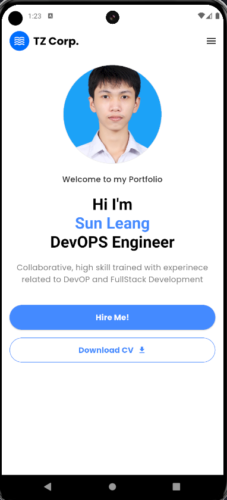

# Personal Portfolio App

## Overview

This Flutter mobile app serves as my personal portfolio, showcasing my skills, projects, and professional background. Inspired by a provided Figma design, I customized the app to reflect my unique style and preferences.

## Features

- **Profile Section**: Displays my photo, name, and profession.
- **Introduction/Bio**: A brief description of my skills and background.
- **Contact Buttons**:
  - **Hire Me**: Links to my github for potential opportunities.
  - **Download CV**: Provides a link to my LinkedIn profile for easy access to my resume.

## Installation

1. Clone the repository:
   ```bash
   git clone https://github.com/SunLeang/Flutter_Learn.git

2. Navigate to the project directory:
   ```bash
   cd Flutter_Learn

3. Install dependencies:
   ```bash
   flutter pub get

4. Run the app:
   ```bash
   flutter run

## Screenshot: 
